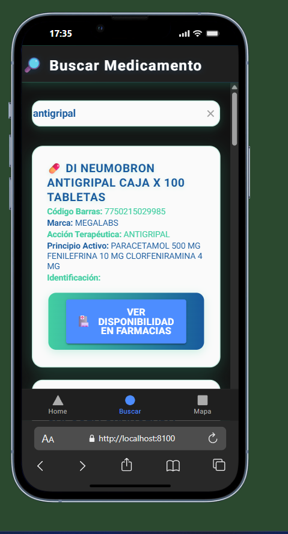
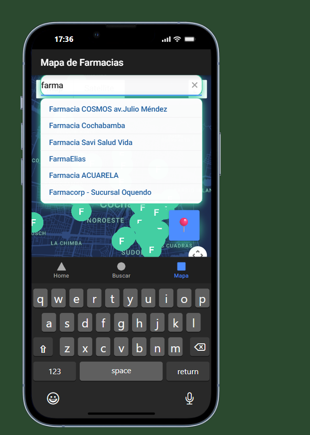
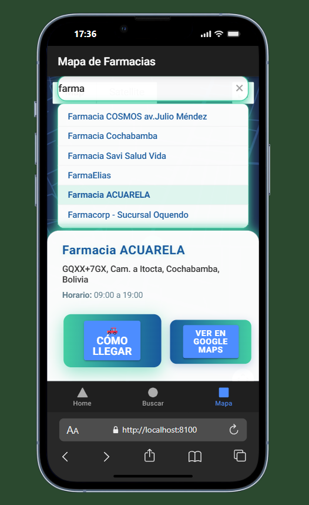

# MediNow
[Ver video de la app — "Tu farmacia en tus manos"](src/El%20texto%20del%20párrafolla%20nueva%20app%20tu%20farmacia%20en%20tus%20manos.mp4)
<video controls width="720" src="src/El%20texto%20del%20párrafolla%20nueva%20app%20tu%20farmacia%20en%20tus%20manos.mp4">
  Tu navegador no soporta la reproducción de video.
</video>

Proyecto integral para la gestión de turnos y productos en farmacias, con frontend moderno (React/Ionic), backend en Python (Flask) y Node.js, integración con Firebase y Algolia, mapas, IA y pruebas automatizadas.

## Estructura del proyecto

- **farmacias_productos.csv, farmacias.csv, productos.csv**: Archivos de datos exportados desde MongoDB.
- **turnos.py**: Script para exportar datos de MongoDB a CSV.
- **farmacias-turno/**: Carpeta principal de la app web/móvil.
  - **api/**: Backend REST (Python Flask y Node.js).
    - `app.py`: API Flask con endpoints para farmacias, productos y búsqueda avanzada.
    - `fix_latlng.py`, `fix_turno.py`: Scripts para normalización de datos.
    - `index.js`: API Node.js para sincronización y tareas.
  - **src/**: Frontend React/Ionic.
    - `pages/`: Vistas principales (buscador, disponibilidad, mapa, tabs).
    - `components/`: Componentes reutilizables (cards, modal de mapa, etc).
    - `services/`: Conexión a Algolia y Firebase.
    - `theme/`: Estilos globales.
  - **public/**: Recursos estáticos.
  - **cypress/**: Pruebas end-to-end.
  - **package.json**: Scripts y dependencias del frontend.





## Instalación y configuración

1. Clona el repositorio:
   ```powershell
   git clone <URL-del-repositorio>
   cd farmaciaturnos/farmacias-turno
   ```

2. Instala dependencias del frontend:
   ```powershell
   npm install
   ```

3. Instala dependencias del backend (Python):
   ```powershell
   pip install flask flask-cors pymongo
   ```
   (Asegúrate de tener Python 3.13 o superior)

4. Configura las credenciales:
   - Firebase: `app-movil-farmacia-v2-firebase-adminsdk-fbsvc-702815dc65.json` en la raíz de `farmacias-turno`.
   - Algolia: Llaves en los archivos de servicio y scripts de sincronización.
   - Google Maps: API key en `.env` o directamente en los componentes.

## Ejecución

### Frontend (React/Ionic)
```powershell
npm run dev
```
Accede a la app en `http://localhost:5173`.

### Backend (Python Flask)
```powershell
python farmacias-turno/api/app.py
```
API disponible en `http://localhost:4000`.

### Exportar datos desde MongoDB a CSV
```powershell
python turnos.py
```
Genera los archivos CSV para farmacias y productos.

### Sincronización Firestore → Algolia
```powershell
node farmacias-turno/sync_firestore_to_algolia.js
```
Sincroniza productos y farmacias con Algolia para búsquedas rápidas.

## Principales scripts y comandos

- `npm run dev`: Inicia el frontend en modo desarrollo.
- `npm run build`: Compila el frontend para producción.
- `npm run preview`: Previsualiza el build.
- `npm run test.e2e`: Ejecuta pruebas Cypress.
- `npm run test.unit`: Ejecuta pruebas unitarias (Vitest).
- `npm run lint`: Linter de código.

## Endpoints principales (Flask API)

- `GET /farmacias`: Lista todas las farmacias.
- `GET /productos`: Lista todos los productos.
- `GET /farmacia_productos`: Relación farmacia-producto-stock-precio.
- `GET /buscar_productos?q=...`: Búsqueda avanzada por nombre, marca, código, principio activo, etc.

## Funcionalidades destacadas

- **Búsqueda inteligente**: Si no se encuentra un producto, se consultan sugerencias a OpenAI (IA).
- **Disponibilidad en farmacias**: Consulta en tiempo real el stock y precio en cada farmacia.
- **Mapa interactivo**: Visualización de farmacias con Google Maps, búsqueda y geolocalización.
- **Sincronización Algolia**: Búsqueda ultra-rápida de productos y farmacias.
- **Integración Firebase**: Gestión de usuarios y datos en Firestore.
- **Pruebas automatizadas**: Cypress para E2E y Vitest para unitarias.

## Dependencias principales

- **Frontend**: React, Ionic, Algolia, Firebase, Google Maps, Cypress, Vitest, ESLint.
- **Backend**: Flask, Flask-CORS, PyMongo, Node.js, Algolia, Firebase Admin SDK.

## Recomendaciones y buenas prácticas

- Mantén tus llaves y credenciales fuera del código público.
- Usa variables de entorno para API keys.
- Ejecuta las pruebas antes de cada despliegue.
- Sincroniza los datos con Algolia tras cada actualización relevante.
- Revisa los logs y errores en consola para depuración.

## Pruebas

### End-to-End (Cypress)
```powershell
npx cypress open
```
Ejemplo de test:
```typescript
describe('My First Test', () => {
  it('Visits the app root url', () => {
    cy.visit('/')
    cy.contains('ion-content', 'Tab 1 page')
  })
})
```

### Unitarias (Vitest)
```powershell
npm run test.unit
```

## Contacto y soporte

Para dudas, soporte o sugerencias, contacta al desarrollador principal.

---
Este README cubre desde la arquitectura, instalación, ejecución, endpoints, integración IA, mapas, pruebas y recomendaciones. Si necesitas ejemplos de código, flujos o detalles extra, ¡solicítalo!
